# Cardiovascular Disease Prediction

## The Context

This project was based on the Kaggle dataset that provides information on 70.000 patients with and without cardiovascular diseases. To make it more interesting, a hypothetical industry-driven situation was formulated by Meigaron Lopes. The hypothetical company called Cardio Catch Diseases is a company specialized in cardiovascular diagnoses and its profits comes from the accuracy of the diagnoses. The current diagnose is made via software or by experts, and the accuracy achieved ranges from 55% to 65%. The cost per patient is $1000,00. The price payed by the patient for the diagnosis varies according to the precision of the diagnosis. For every 1% of precision above 50% the patient pays $100,00. For instance, if a patient was diagnosed with 55% of accuracy, the patient will pay $500,00. If the accuracy was 50%, the patient does not pay anything. 

Kaggle Dataset: https://www.kaggle.com/sulianova/cardiovascular-disease-dataset

Business context (Portuguese Brazil): https://sejaumdatascientist.com/projeto-de-data-science-diagnostico-precoce-de-doencas-cardiovasculares/

 

## The Challenge

The current diagnostic method is causing the company to lose money and make a very low profit, because if the accuracy is set at 55% it can cause a debt of $35.000.000,00. Thus, this project aimed to solve this problem by improving the diagnostic accuracy.

 

## The Solution

The solution offered is a machine learning algorithm that can overcome the current diagnostic method. In this project, several machine learning models were tested, and the best was chosen. Catboost classifier offered a precision range of 75.01% up to 76.03%. 

In terms of health, it means that at least 75% of people can be correctly diagnosed and receive treatment, an increase of 10%. In real numbers, over 7000 people can be correctly diagnosed by the machine learning solution. 

In business terms, even in the worst case scenario, the company will never have a debt, but a profit of $105,070,000.00, an increase in revenues of 68.8%.

 

## Project Development

### Understanding the Dataset

The dataset is composed by the following variables:

#### Objective - factual information:

- Age (days);
- Height (cm);
- Weight (kg);
- Gender (binary 1 - women | 2 - men).

#### Examination - results of medical examination:

- Systolic blood pressure (ap_hi);
- Diastolic blood pressure (ap_lo);
- Cholesterol (cholesterol - 1: normal, 2: above normal, 3: well above normal);
- Glucose (gluc - 1: normal, 2: above normal, 3: well above normal).

#### Subjective - information given by the patient:

- Smoking (smoke - binary);
- Alcohol intake (alco - binary);
- Physical Activity (active - binary).

#### Target Variable:

- Presence or absence of cardiovascular disease (cardio – binary).

 

### Exploratory Data Analysis

Descriptive Statistics

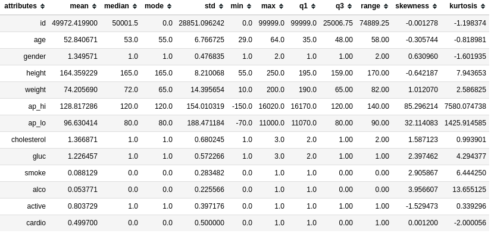

The only change made was to change the age from days to years.

#### Keys points:

- The mean age is 52 years, ranging from 29 to 64;
- There are more women than men in the dataset;
- Glucose and cholesterol levels in most people are normal;
- Most people do not smoke (8,81%) drink alcohol (5,37%) and exercise (80,37%);

Some numerical variables have outliers based on their skewness.

- Height - negative moderately skewed;
- Weight - positive moderated skewed;
- ap_hi, ap_lo - positive high skewed.
    
There are unrealistic values (outliers) in the dataset as:

- height of 55 cm and 250 cm;
- weight of 10 Kg;
- ap_hi of -150 and 16020;
- ap_lo of -70 and 11000.

#### The decision taken was to remove the outliers from the dataset according to the medical literature. In total, only 2.02% of the data were removed.

### Univariate Analysis – Target Variable

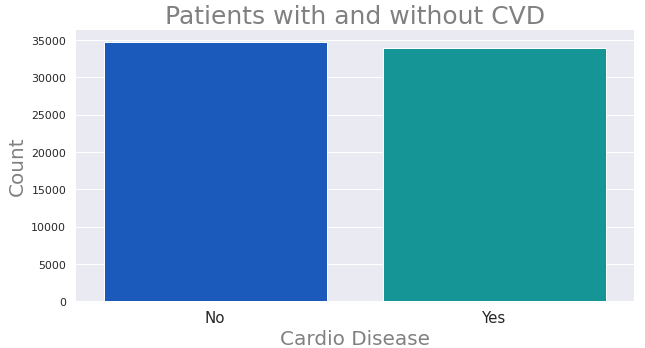

#### As can be seen, the quantities of patients with or without CVD are almost the same (around 35000 each).

### Bivariate Analysis

#### Key point: All the analysis made in this section try to  verify if they reflect the findings of scientific research (that's why simple hypothesis were made). To really understand the dataset these samples must be ignored and the analysis must be made considering all dataset and its imbalance.

To perform the bivariate analysis it was formulated a hypothesis mental map to help. 

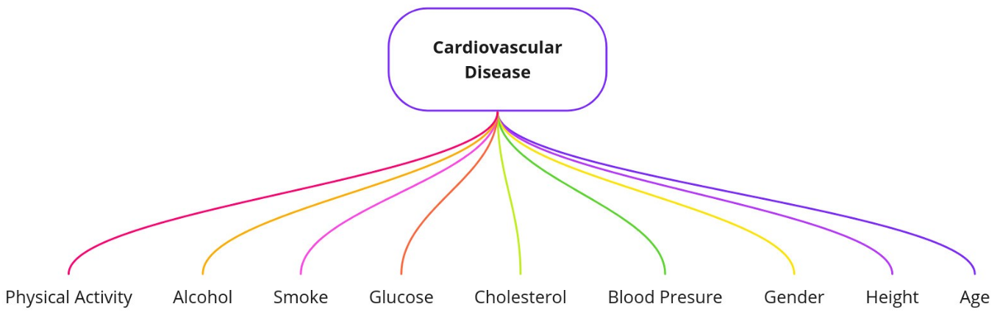

 

### Hypothesis List

#### Based on the medical literature, the follow hypothesis were formulated:

H1 - Older people have more cardiovascular diseases

H2 - Smaller people have more cardiovascular diseases

H3 - Men have more cardiovascular diseasess

H4 - People with higher blood pressure have more cardiovascular diseases

H5 - People with higher cholesterol have more cardiovascular diseases

H6 - People with higher glucose have more cardiovascular diseases

H7 - People who smoke have more cardiovascular diseases

H8 - People who drink alcohol have more cardiovascular diseases

H9 - Sedentary people have more cardiovascular diseasess

#### Based on the hypothesis list some features were created as BMI index, blood pressure aggregating ap_hi and ap_lo and a risk scale. Thus, 2 more hypothesis were added.

H10 - People with higher BMI have more cardiovascular diseases

H11 - People with higher Risk Scale of CVD have more cardiovascular diseases

To exemplify how the hypothesis were tested, the validation of the sixth hypothesis (H6 - People with higher glucose have more cardiovascular diseases) is demonstrated below:

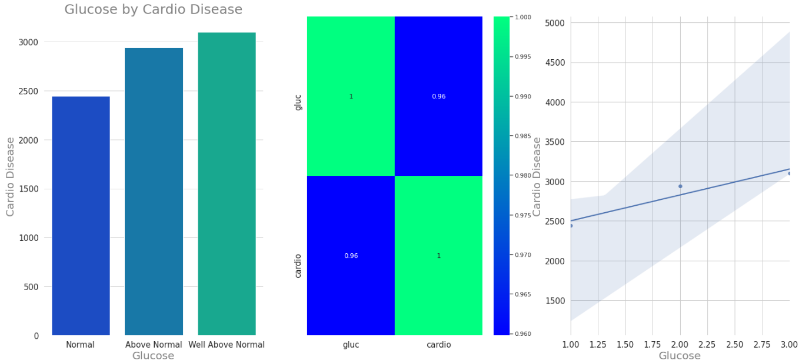

As can be seen, the hypothesis is true and the correlation is very strong (0.95).

#### The hypothesis validation culminated in the following results:

H1 - Older people have more cardiovascular disease - True

H2 - Smaller people have more cardiovascular diseases - True

H3 - Men have more cardiovascular diseases - True

H4 - People with higher blood pressure have more cardiovascular diseases - True

H5 - People with higher cholesterol have more cardiovascular diseases - True

H6 - People with higher glucose have more cardiovascular diseases - True

H7 - People who smoke have more cardiovascular diseases - False

H8 - People who drink alcohol have more cardiovascular diseases - False

H9 - Sedentary people have more cardiovascular diseases - False

H10 - People with higher BMI have more cardiovascular diseases - False

H11 People with higher Risk Scale of CVD have more cardiovascular diseases – False

 

### Multivariate Analysis

In this sections it was analyzed all combinations of numerical and non-numerical variables, such as person’s correlation, point bisserial correlation and cramer’s v.

#### Pearson's Correlation

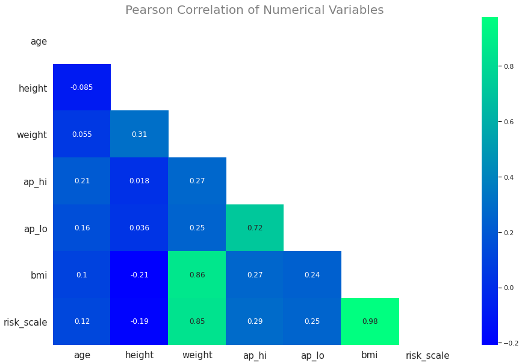

##### Key points:

The strongest positive correlations are between:

- bmi x risk_scale (0.98);
- weight x bmi (0.86);
- weight x risk_scale (0.85);
- ap_hi x ap_lo (0.69).

#### Point Bisserial Correlation

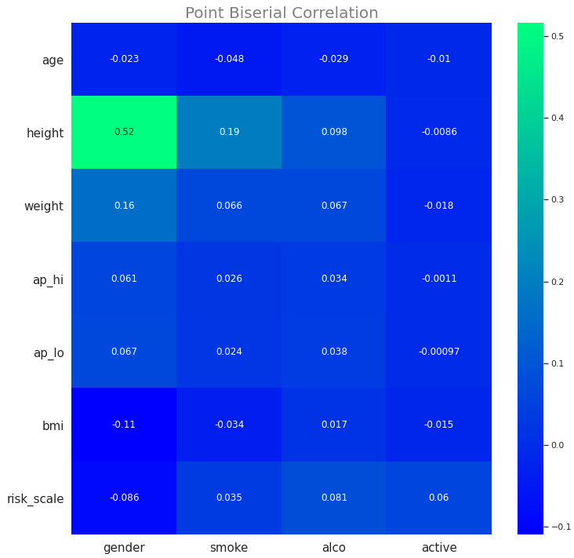

#### Crmaver's V

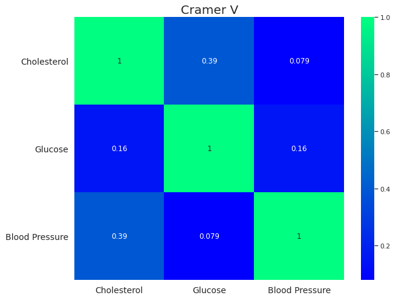

 

### Feature Selection

To select the best features for the machine learning models a feature selection was performed. The results among all the selectors varied a lot and the decision made was to maintain the boruta outcomes plus some other features that were signaled as important by the other models. As an exempla, it is showed the LGBM feature selector result:

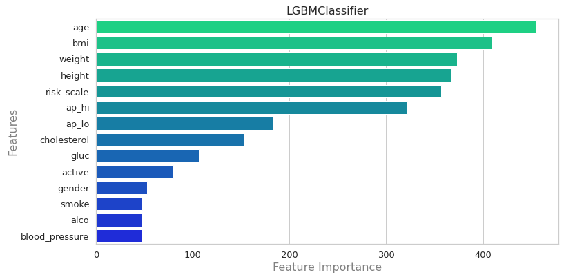

 

### Machine Learning Classifiers

It was tested several machine learning models and the results are shown below:

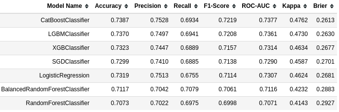

As can be seen with the default hyperparameters Catboost Classifier have shown the best results according to F1-Score. 

To improve this results is was calculated the best threshold to two of the best models (CatBoost and LGBM). The treshold for both were similar (0,41 and 0,42). The results are shown below:

##### Catboost Classifier  was chosen as the best classifier. 

Two hyperparameter fine tuning technics were applied, Bayes Search and Grid search. The results were the same. The tuned model ended up showing an slightly better performance compared to the default model in terms of precision. An attempt was made to improve the model using isotonic and sigmoid calibration, but there was no improvement.

The results of cross-validation is as follows with the test dataset:

Default Model:

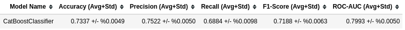

Tuned Model:

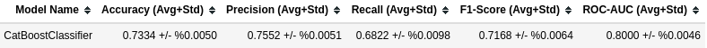

The tuned model was chosen, once it has the best precision score to address the business issue. In terms of overall performance both can be chosen, because the results are very similar.

 

### Business Performance

The CatBoost classifier generated CVD forecasts with average accuracy of 75.5%. The entire data set has 70,000 patients. To calculate the profit generated by the model, the outcomes of the current solution (health software) were considered and compared with the model.

#### Business issues:

- For 1% increase in precision the patient's bill increases $100,00
- The diagnosis cost is $1000,00 per patient
- The precision rate of the current solution varies from 55% (worst scenario) to 65% (best scenario)
- The precision rate of the machine learn model varies from 75.01% (worst scenario) to %76.03 (best scenario)

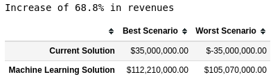

The current solution (health software) can generate a terrible outcome of **$35 million debt**. Even in the worst scenario the Machine Learning Model will never generate a debt. In that case, the outcome still remains positive, resulting in a **profit of $105 million.**

Compared to the current solution the Machine Learning model is capable of **increase revenues in 68.8%.**

